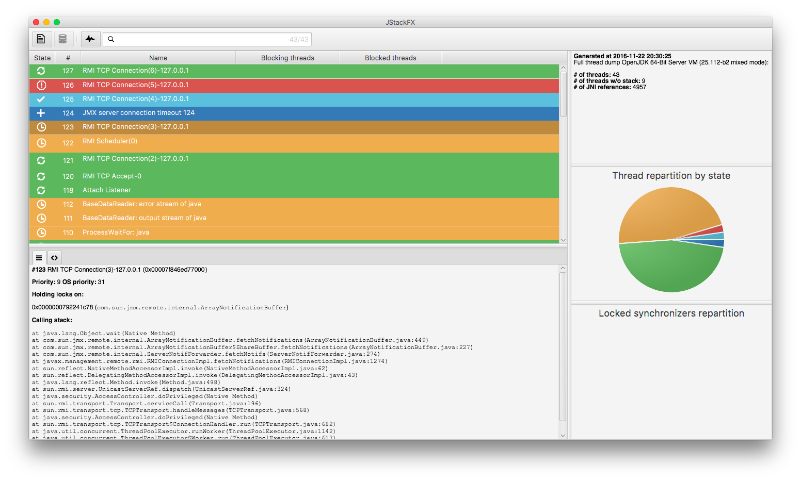
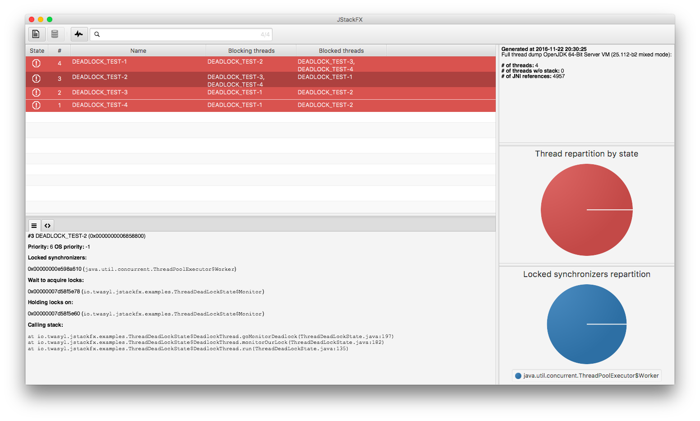
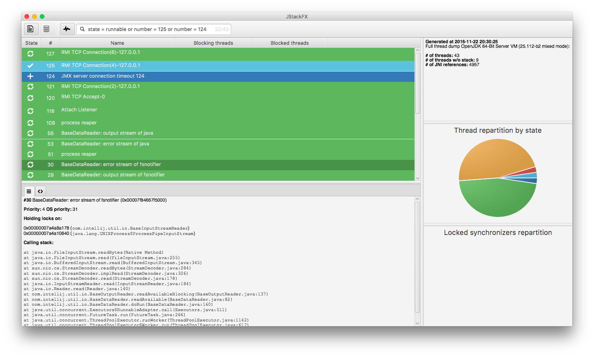
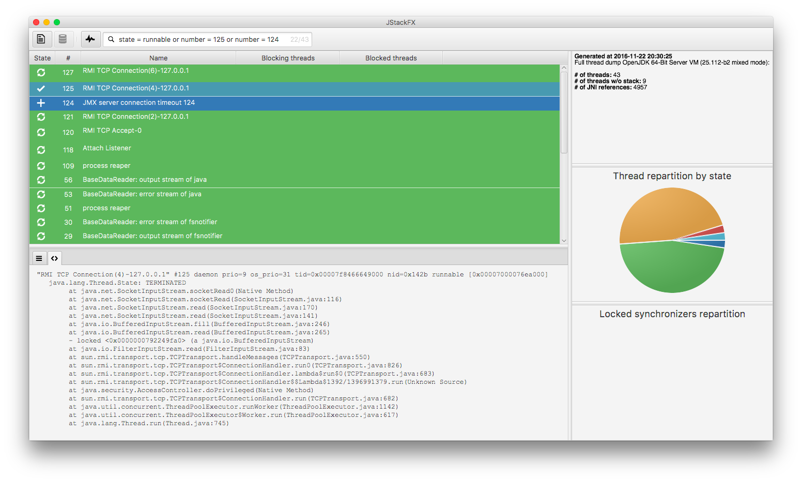

[](https://travis-ci.org/twasyl/jstackfx)

# Context

It is not an easy task to analyse thread dumps as files generated by the `jstack` tool provides raw _text files_.
This is why I'm developing **JStackFX**.

# Requirements

JStackFX requires the latest JDK 8 available on your system.

# Build

As JStackFX is currently under development, you can build it manually in order to have the latest version. In order to build it, ensure the JDK 8 is available and execute the following command:

```shell
gradlew clean assemble
```

# Execution

In order to start JStackFX, unzip the `build/distributions/JStackFX-<version>.zip` archive and start a command line within the unzipped folder. Execute the following command:

```shell
java -jar jstackfx-<version>.jar
```

In order to start JStackFX and open directly a dump file you can use the following command:

```shell
java -jar jstackfx-<version>.jar --file=/path/to/dump.txt
```

In order to start JStackFX and make a thread dump of a given process you can use the following command:

```shell
java -jar jstackfx-<version>.jar --pid=<pid of the process to dump>
```

**Warning:** if both `--pid` and `--file` parameters are used, `--file` is ignored.

# Screenshot````






# Usage

## SearchingF

Use the search bar in JStackFX to filter results. A query must have the following syntax:

```shell
fieldName comparator value operand fieldName comparator value ...
```

* _fieldName_ can be: **state**, **number**, **threadId**, **priority** or **osPriority**
* _comparator_ can be: **=**, **!=**, **<=**, **<***, **>=** or **>**
* _operand_ can be: **and** or **or**

<u>Examples:</u>

* List all RUNNABLE threads:`state = runnable`
* Display threads having number 10 or 20: `number = 10 or number = 20`
* Display threads having number 10 or thread having number 20 and is in state BLOCKED: `number = 10 or number = 20 and state = blocked`

# Release notes

## Version 1.3

**New and noteworthy:**

* Support for operators `<=`, `<`, `>=` and `>`
* UI improvements

## Version 1.2

**New and noteworthy:**

* Display the number of results in the search bar
* Allow to display thread elements' source from the dump file
* UX improvements

## Version 1.1

**New and noteworthy:**

* Adding a search bar for filtering results
* Change the cursor when over a blocked or blocking thread in the table
* Make some information of the thread copyable